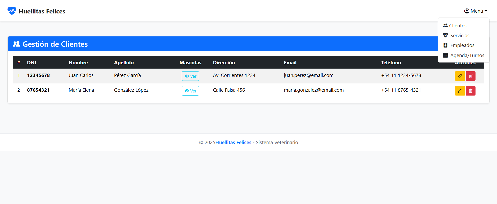
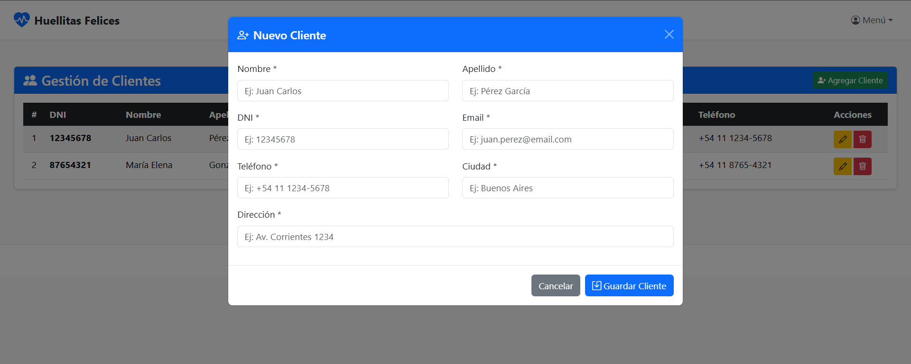
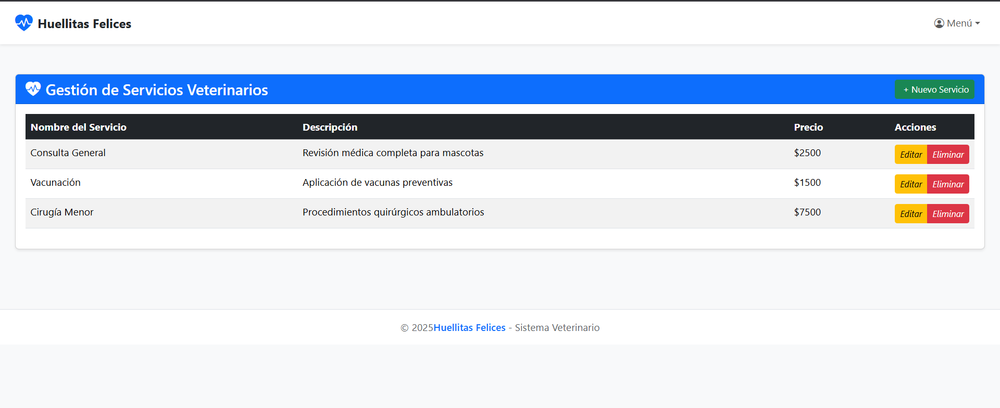
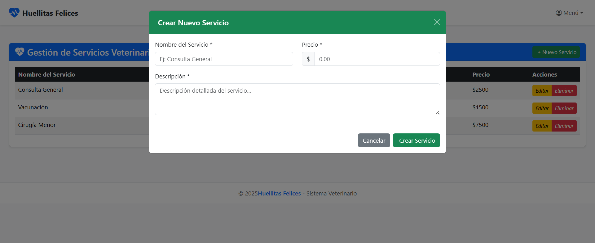
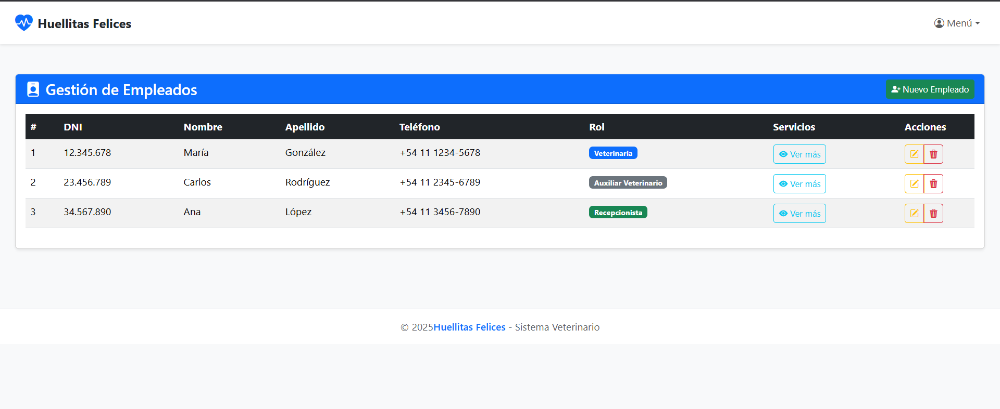
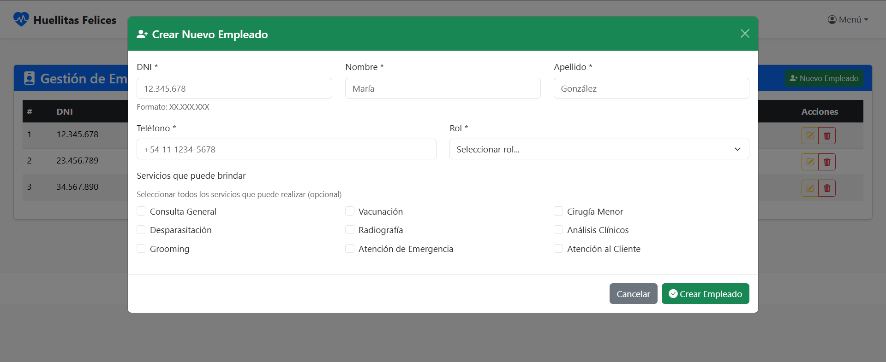
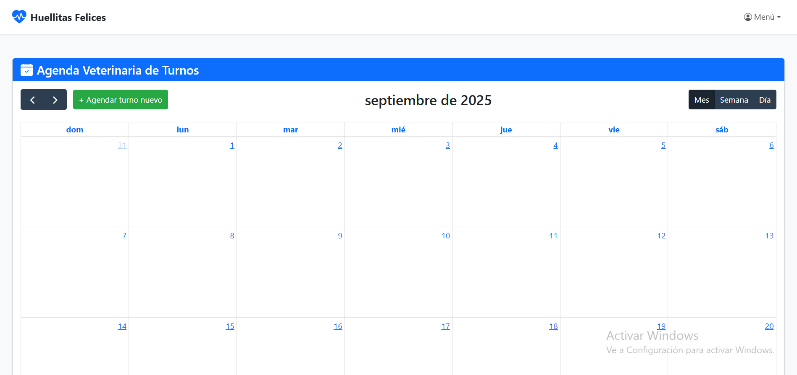
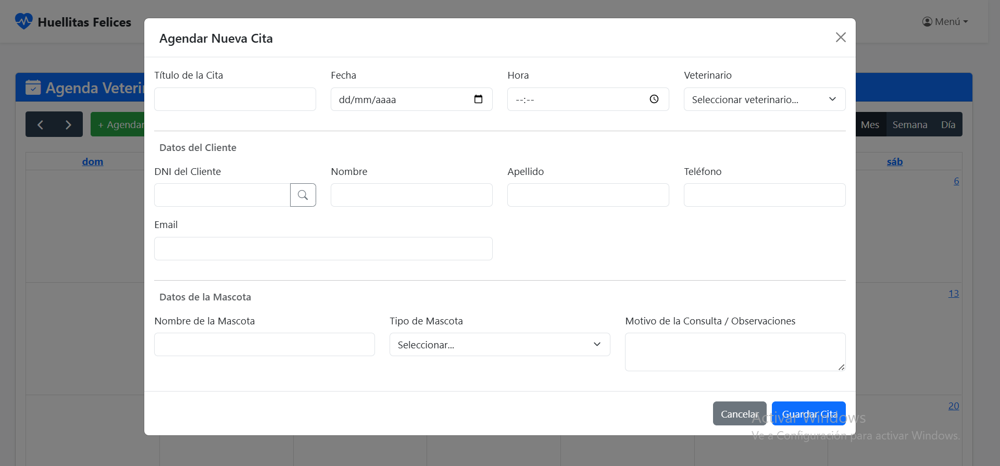

# **Sistema de Gestión Veterinaria - Huellitas Felices**
**Desarrollado por:** [Brian Alcaraz](https://www.linkedin.com/in/alcarazbrian/) y [Mayra Ferrazin Nervegna] 🚀

---

## **⚠️ Licencia y Términos de Uso**
Este proyecto está protegido bajo los siguientes términos:

### **🔒 Licencia Privada (Todos los derechos reservados)**
- **Prohibido el uso comercial:** No está permitido utilizar este código en proyectos comerciales o con fines de lucro sin autorización escrita del autor.
- **Prohibida la redistribución:** No se permite copiar, modificar, distribuir o utilizar este código en otros proyectos sin consentimiento explícito.
- **Uso académico permitido:** Este proyecto puede ser utilizado **únicamente** como referencia para fines educativos o demostrativos, siempre citando al autor original.
- **Atribución obligatoria:** Si se utiliza como referencia, se debe mencionar explícitamente al autor (**Brian Alcaraz**) y este repositorio.

> **Advertencia:** Cualquier uso no autorizado de este código será considerado una violación de derechos de autor y estará sujeto a acciones legales.

---

---

## **👥 Colaboración**
Este proyecto es el resultado de una **colaboración académica** entre **Brian Alcaraz** y **Mayra Ferrazin Nervegna**.

> **Aclaración:**
> - La **idea general del proyecto** es compartida.
> - Cada colaborador desarrolló su propia versión de los módulos que les correspondia realizar.
> - Esta rama contiene las **contribuciones de Brian Alcaraz**, que posteriormente se unirán con las de Mayra Ferrazin Nervegna en una versión final consolidada.

---

---

## **📌 Descripción del Proyecto**
**Huellitas Felices** es un sistema de gestión veterinaria desarrollado como proyecto académico, diseñado para optimizar la administración de clientes, mascotas, ventas, empleados, servicios y citas en una clínica veterinaria. El sistema cuenta con una arquitectura **MVC** (Modelo-Vista-Controlador) y utiliza tecnologías modernas como **Node.js, Express, MongoDB Atlas y Mongoose** en el backend, junto con **Pug, Bootstrap 5 y FullCalendar** en el frontend.

### **🔹 Características Principales**
- **Gestión de Clientes:** CRUD completo para registrar y administrar la información de los clientes y sus mascotas.
- **Gestión de Empleados:** CRUD - Administración de empleados con roles y servicios asociados.
- **Gestión de Servicios:** CRUD - Catálogo de servicios veterinarios con precios y descripciones.
- **Agenda de Citas/Turnos:** CRUD - Interfaz interactiva con **FullCalendar** para gestionar citas y turnos.
- **Diseño Responsivo:** Interfaz adaptable a dispositivos móviles y de escritorio.
- **Mejoras Futuras:** Integración de **DataTables** para paginación, búsqueda y filtros avanzados. El diseño UX es importante ya que le brinda visualmente le ayuda al usuario a tener una mejor experiencia.
- **Enfoque profesional:** Estructura de carpetas que facilita el mantenimiento y escalabilidad del código.
- **Estructura modular:** Separación clara entre `frontend` y `backend`, siguiendo buenas prácticas de organización de proyectos.
- **Sintaxis moderna:** Uso de `import/export` (ES6 Modules)
- **Axios:** Se planea utilizar en lugar de `fetch` para un manejo más eficiente de peticiones HTTP, gracias a su sintaxis simplificada, manejo automático de errores y soporte para interceptores y configuraciones globales.

---

---

## **🛠 Tecnologías Utilizadas**
| **Categoría**             | **Tecnologías**                                                     |
|---------------------------|---------------------------------------------------------------------|
| **Backend**               | Node.js, Express, MongoDB Atlas, Mongoose                           |
| **Frontend**              | Pug, Bootstrap 5, FullCalendar, JavaScript (ES6+)                   |
| **Control de Versiones**  | Git, GitHub                                                         |
| **Herramientas**          | Visual Studio Code, Thunder Client (para pruebas de API)            |

---

## **📖 Documentación**
Los modulos de esta rama cuenta con documentación detallada para cada módulo. Puedes acceder a ella desde los siguientes enlaces:

- **[Documentación General del Sistema](https://docs.google.com/document/d/1ViyzMaNjs7ADEbPM8UIul4XVd2cpSVogAORSoDs-xpM/edit?usp=sharing)**

> **Nota:** La documentación incluye descripciones detalladas, flujos de trabajo, estructura de datos y ejemplos de uso para cada módulo.

---

## **🚀 Instalación y Configuración**
**Próximamente** se proporcionarán instrucciones detalladas para la instalación y configuración del proyecto unificado.

---

---
## 🖼️ Imágenes de los Módulos de esta Rama

A continuación, se presentan algunas capturas:

### 🚀 Vista de la Interfaz de Usuario

---

---

## Agradecimientos

Queremos expresar nuestro sincero **agradecimiento** a quienes hicieron posible este proyecto con su guía y apoyo:

* A **nuestros profesores**, por su invaluable conocimiento, paciencia y dedicación, que han sido fundamentales para nuestro desarrollo como personas y profesioanles.
* Al **ISFT N°225** (Instituto Superior de Formación Técnica N° 225), por brindarnos el espacio y las herramientas para crecer profesionalmente.

[**Pagina Web de ISFT N°225**](https://isft225.edu.ar/)

---